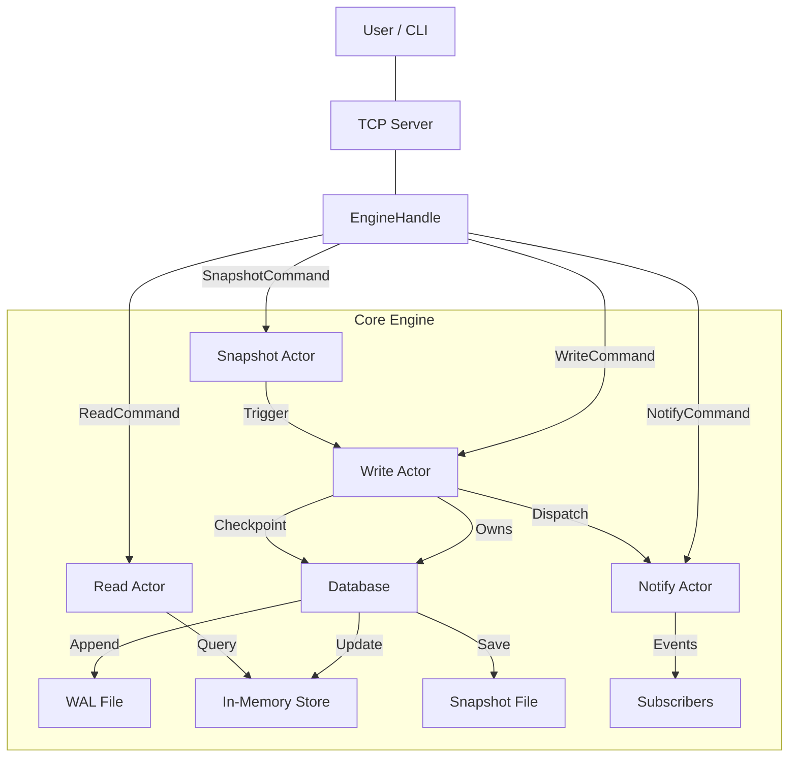

# FluxDB

FluxDB is a single-node, durable, reactive key-value store designed to ensure core invariants of storage engines. It provides strong guarantees for correctness, durability, and deterministic recovery.

---

# Architecture

FluxDB uses an actor-based architecture to manage concurrency and ensure data consistency.



---

# Core Features

FluxDB delivers a crash-safe local database core with:

### Durability

- Write-Ahead Log (WAL)
- fsync before visibility
- Redo-only crash recovery

### Persistence Acceleration

- Atomic snapshot creation
- WAL truncation after checkpoint
- Deterministic restart state

### Reactive System

- Key-level subscriptions
- Event dispatch on mutation
- Bounded channels with slow-subscriber eviction

### Correctness Invariants

- WAL-before-memory visibility
- Deterministic replay
- Silent recovery (no historical event emission)
- Bounded memory under slow consumers

---

# Data Model

FluxDB stores JSON documents with logical versions.

```
key -> JSON document + version
```

### Document Structure

```
{
  value: serde_json::Value,
  version: u64   // per-key logical version
}
```

Versioning is per-key and monotonically increasing, providing a foundation for concurrency control.

---

# CLI Interface

FluxDB exposes a terminal interface for direct interaction.

## SET

```
SET <key> <json>
```

Stores or overwrites a JSON value.

**Examples**

```
SET a "hello"
SET b 42
SET user {"name":"vaibhav","age":21}
SET nums [1,2,3]
```

Behavior:

- WAL append -> fsync -> memory apply -> event dispatch
- Version increments per mutation
- Invalid JSON is rejected

---

## GET

```
GET <key>
```

Returns the latest stored document.

**Example**

```
GET user
-> Document { value: {"name":"vaibhav","age":21}, version: 1 }
```

---

## DELETE

```
DELETE <key>
```

Removes the key via a versioned tombstone event.

---

## PATCH

```
PATCH <key> <json_delta>
```

Performs a recursive JSON merge:

- object fields merged
- non-objects overwritten

**Example**

```
SET profile {"name":"vaibhav"}
PATCH profile {"age":21}
```

Result:

```
{"name":"vaibhav","age":21}
```

---

## CHECKPOINT

```
CHECKPOINT
```

Creates an atomic snapshot of the full in-memory state and current WAL offset.

Protocol:

```
write temp -> fsync -> atomic rename -> fsync directory
```

Guarantees crash-safe persistence.

---

## EXIT

```
EXIT
```

Gracefully terminates the CLI.

---

# Benchmarks

FluxDB performance metrics for in-process and network operations.

### Benchmark Environment

To provide "serious engineer" level evidence, here are the technical parameters of these tests:

- **Hardware**: AMD Ryzen 5 5600H (6 Cores, 12 Threads) @ 3.30GHz
- **RAM**: 16GB
- **Storage Medium**: NVMe SSD
- **Durability**: `fsync` enabled (enforced after every write batch)
- **Write Batching**: Opportunistic draining + 5ms heartbeat interval
- **Payload Size**: ~50 bytes per document (`{"id": i, "data": "benchmark data"}`)

## In-Process Benchmarks

Results obtained using `cargo run --bin bench -- --writes 10000 --reads 10000 --concurrency 100`:

| Operation | Throughput (ops/sec) | P50 Latency | P95 Latency | P99 Latency |
| --------- | -------------------- | ----------- | ----------- | ----------- |
| SET       | 23,148.62            | 3.76ms      | 8.81ms      | 17.25ms     |
| GET       | 210,310.86           | 481.21us    | 608.96us    | 731.94us    |
| MIXED     | 14,184.41            | 3.92ms      | 16.62ms     | 300.09ms    |

## Network Benchmarks

Results obtained using `cargo run --bin bench_network -- --writes 10000 --reads 10000 --concurrency 100`:

| Operation | Throughput (ops/sec) | P50 Latency | P95 Latency | P99 Latency |
| --------- | -------------------- | ----------- | ----------- | ----------- |
| SET       | 17,550.45            | 4.57ms      | 16.51ms     | 17.79ms     |
| GET       | 88,301.05            | 1.04ms      | 1.94ms      | 2.51ms      |
| MIXED     | 22,248.19            | 4.22ms      | 10.85ms     | 21.23ms     |

---

# How to Run Benchmarks

### In-Process Benchmark

```bash
# Standard GET/SET
cargo run --bin bench -- --writes 10000 --reads 10000 --concurrency 100

# Mixed Workload (SET/GET/PATCH/DEL)
cargo run --bin bench -- --mixed --writes 10000 --concurrency 100
```

### Network Benchmark

1. Start the server:

```bash
cargo run --bin server
```

2. In another terminal, run the benchmark:

```bash
# Standard GET/SET
cargo run --bin bench_network -- --writes 10000 --reads 10000 --concurrency 100

# Mixed Workload (SET/GET/PATCH/DEL)
cargo run --bin bench_network -- --mixed --writes 10000 --concurrency 100
```

---

# Storage System

FluxDB uses log-structured storage with checkpoints.

## Write Path

```
Event
 -> WAL append
 -> fsync
 -> apply to memory
 -> reactive dispatch
```

## Recovery Path

```
Load snapshot
 -> replay WAL suffix
 -> rebuild deterministic state
```

---

# Reactive Subsystem

Each key maintains multiple independent subscribers using bounded channels.

Backpressure handling:

- non-blocking dispatch (try_send)
- closed channel -> removed
- full buffer -> slow subscriber evicted

Guarantee:

> Subscribers never block database writes.

---

# Running FluxDB

### Direct CLI (In-Process)

Run the database with an integrated terminal interface:

```bash
cargo run
```

### TCP Server and Client

1. Start the FluxDB server:

```bash
cargo run --bin server
```

2. Connect via the interactive TCP shell:

```bash
cargo run --bin client -- shell
```

3. Run a single command via TCP:

```bash
cargo run --bin client -- set mykey '{"status": "online"}'
```

---

# License

Educational / experimental project.
