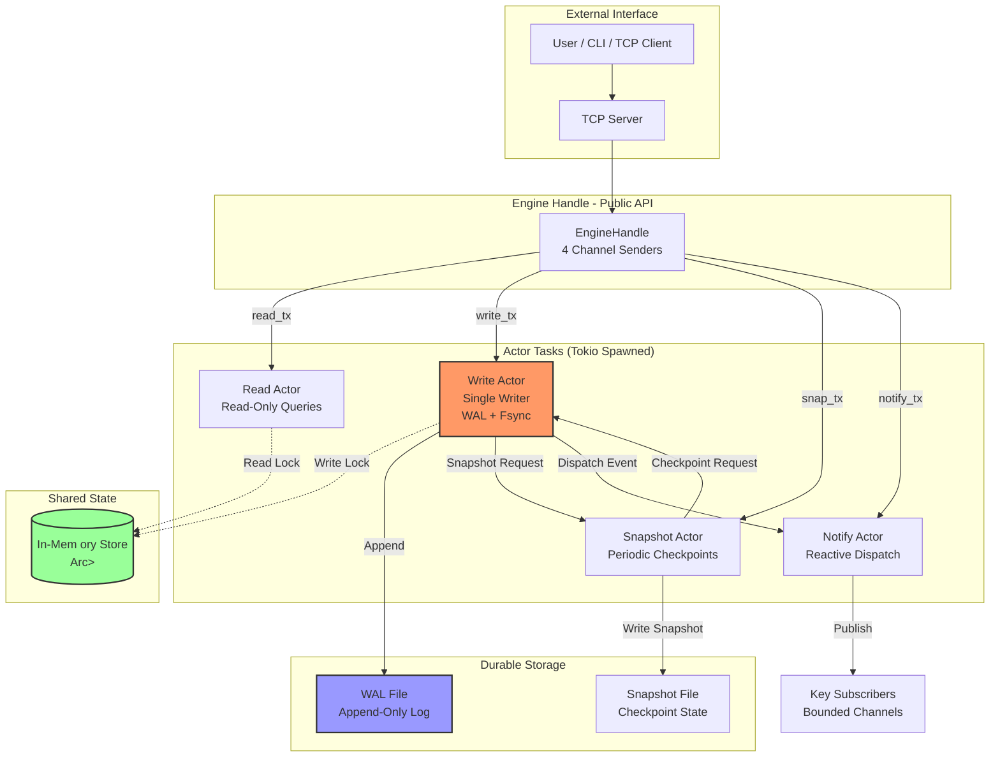
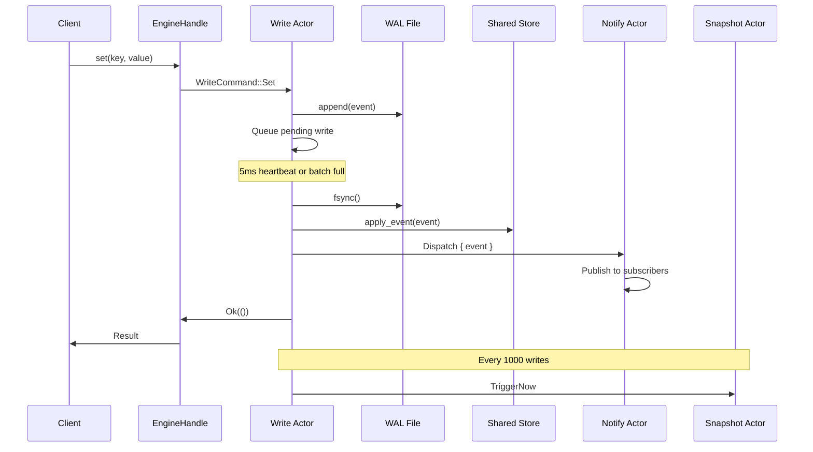
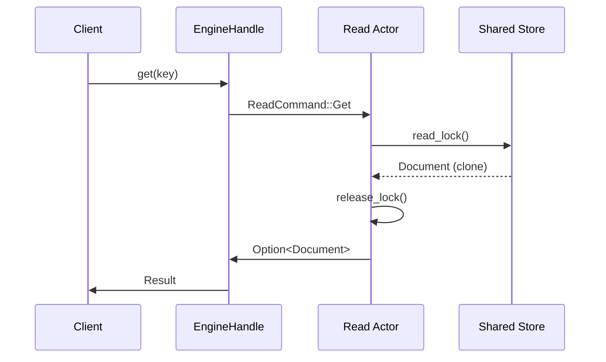
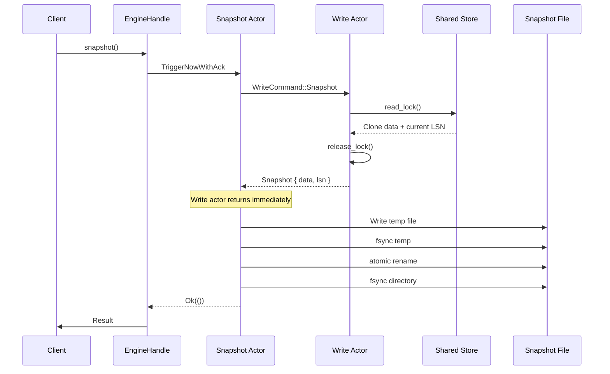

# FluxDB Actor Model - Architecture

## Overview

FluxDB implements an **actor-based concurrency model** using Tokio's async runtime. The design follows the principle of **separation of concerns**, where each actor is responsible for a specific task and communicates with others via message-passing channels.

---

## System Architecture



---

## Channel Topology

```
┌─────────────────────────────────────────────────────────────┐
│                     EngineHandle                             │
│  ┌──────────┬──────────┬──────────┬──────────┐              │
│  │ read_tx  │ write_tx │ snap_tx  │ notify_tx│              │
│  └────┬─────┴────┬─────┴────┬─────┴────┬─────┘              │
└───────┼──────────┼──────────┼──────────┼────────────────────┘
        │          │          │          │
        ▼          ▼          ▼          ▼
   ┌────────┐ ┌────────┐ ┌────────┐ ┌────────┐
   │  Read  │ │ Write  │ │Snapshot│ │ Notify │
   │ Actor  │ │ Actor  │ │ Actor  │ │ Actor  │
   └────────┘ └────────┘ └────────┘ └────────┘
      │          │          │          │
      │          │          │          ▼
      │          │          │    Subscribers
      │          │          │
      │          │          ▼
      │          │     (requests Snapshot)
      │          │          │
      │          ▼          │
      │     ┌────────┐      │
      │     │  WAL   │      │
      │     └────────┘      │
      │          │          │
      ▼          ▼          ▼
   ┌────────────────────────────┐
   │    Arc<RwLock<Store>>      │
   │    (Shared In-Memory)      │
   └────────────────────────────┘
```

**Channel Capacities:**
- All channels: **32 messages** (bounded)
- Bounded channels provide backpressure
- Prevents unbounded memory growth

---

## Actor Components

### 1. Write Actor

**Location:** `src/engine/write_actor.rs`

**Purpose:** Single-writer actor that owns all write operations, WAL durability, and post-durability application.

**Responsibilities:**
- WAL append operations
- Fsync batching (5ms heartbeat timer)
- Pending write queue management
- Post-durability apply to shared store
- Event dispatch coordination
- Snapshot trigger (every 1000 writes)

**Channel Interface:**

| Direction | Type | Message Type |
| :--- | :--- | :--- |
| Input | `mpsc::Receiver` | `WriteCommand` |
| Output (to Snapshot) | `mpsc::Sender` | `SnapshotActorCommand` |
| Output (to Notify) | `mpsc::Sender` | `NotifyCommand` |

---

### 2. Read Actor

**Location:** `src/engine/read_actor.rs`

**Purpose:** Handles read-only queries against the shared in-memory store.

**Responsibilities:**
- Read-lock acquisition on shared store
- Document lookup and response

**Channel Interface:**

| Direction | Type | Message Type |
| :--- | :--- | :--- |
| Input | `mpsc::Receiver` | `ReadCommand` |
| Shared State | `Arc<RwLock<Store>>` | Read-only access |

---

### 3. Snapshot Actor

**Location:** `src/engine/snapshot_actor.rs`

**Purpose:** Manages periodic checkpoint creation and durable snapshot persistence.

**Responsibilities:**
- Periodic snapshot scheduling (30-second interval)
- On-demand snapshot triggers
- Snapshot file durability (atomic rename + fsync)

**Channel Interface:**

| Direction | Type | Message Type |
| :--- | :--- | :--- |
| Input | `mpsc::Receiver` | `SnapshotActorCommand` |
| Output (to Write) | `mpsc::Sender` | `WriteCommand` |

**Commands:**
- `TriggerNow` - Fire-and-forget snapshot
- `TriggerNowWithAck { resp }` - Snapshot with acknowledgment

---

### 4. Notify Actor

**Location:** `src/engine/notify_actor.rs`

**Purpose:** Manages reactive subscriptions and event dispatch to subscribers.

**Responsibilities:**
- Per-key subscriber registry
- Event dispatch with backpressure handling
- Slow subscriber eviction

**Channel Interface:**

| Direction | Type | Message Type |
| :--- | :--- | :--- |
| Input | `mpsc::Receiver` | `NotifyCommand` |
| Output (to Subscribers) | `mpsc::Sender` | `Event` |

**Commands:**
- `Subscribe { key, resp }` - Subscribe to key events
- `Dispatch { event }` - Publish event to subscribers

---

## Shared State

### Store Architecture

```rust
Arc<RwLock<Store>>
```

**Ownership Model:**

| Actor | Access Type | Usage |
| :--- | :--- | :--- |
| Write Actor | Exclusive write | Modifies store after fsync |
| Read Actor | Shared read | Concurrent reads allowed |

**Lock Granularity:**
- Write actor holds write lock **only during apply** (post-durability)
- Read actor holds read lock **only during lookup**
- Lock is never held during I/O operations

---

## Runtime Initialization

**Location:** `src/engine/runtime.rs`

```rust
pub fn start() -> EngineRuntime {
    // 1. Create channels
    let (read_tx, read_rx) = mpsc::channel::<ReadCommand>(32);
    let (write_tx, write_rx) = mpsc::channel::<WriteCommand>(32);
    let (snap_tx, snap_rx) = mpsc::channel::<SnapshotActorCommand>(32);
    let (notify_tx, notify_rx) = mpsc::channel::<NotifyCommand>(32);

    // 2. Create shared state
    let shared_store = Arc::new(RwLock::new(Store::new()));

    // 3. Spawn actors
    tokio::spawn(read_actor(read_rx, shared_store.clone()));
    tokio::spawn(write_actor(write_rx, shared_store, snap_tx.clone(), notify_tx.clone()));
    tokio::spawn(snapshot_actor(snap_rx, write_tx.clone(), Duration::from_secs(30)));
    
    // 4. Create and spawn notify actor
    let notify = NotifyActor::new(notify_rx);
    tokio::spawn(notify.run());

    // 5. Return handle
    let handle = EngineHandle::new(read_tx, write_tx, snap_tx, notify_tx);
    EngineRuntime { handle }
}
```

**Initialization Order:**
1. Channels created (communication infrastructure)
2. Shared store created (state)
3. Actors spawned (consumers)
4. Handle returned (public API)

---

## Data Flow Sequences

### Write Flow (SET/DELETE/PATCH)



---

### Read Flow (GET)



---

### Snapshot Flow (CHECKPOINT)



---

## Command Types

### WriteCommand

```rust
pub enum WriteCommand {
    Set {
        key: String,
        value: Value,
        resp: oneshot::Sender<Result<(), String>>,
    },
    Del {
        key: String,
        resp: oneshot::Sender<Result<(), String>>,
    },
    Patch {
        key: String,
        delta: Value,
        resp: oneshot::Sender<Result<(), String>>,
    },
    Snapshot {
        resp: oneshot::Sender<Result<Snapshot, String>>,
    },
    InjectFailure {
        resp: oneshot::Sender<()>,
    },
}
```

### ReadCommand

```rust
pub enum ReadCommand {
    Get {
        key: String,
        resp: oneshot::Sender<Option<Document>>,
    },
}
```

### SnapshotActorCommand

```rust
pub enum SnapshotActorCommand {
    TriggerNow,
    TriggerNowWithAck {
        resp: oneshot::Sender<Result<(), String>>,
    },
}
```

### NotifyCommand

```rust
pub enum NotifyCommand {
    Subscribe {
        key: String,
        resp: oneshot::Sender<mpsc::Receiver<Event>>,
    },
    Dispatch {
        event: Event,
    },
}
```

---

## Performance Characteristics

| Operation | Latency Bound | Throughput Factor |
| :--- | :--- | :--- |
| Write (SET/DEL/PATCH) | Fsync latency (~5ms batch) | Batch size |
| Read (GET) | Memory lookup (~500ns) | Lock contention |
| Snapshot | Disk I/O (async) | Doesn't block writes |
| Notify Dispatch | Channel send (~1μs) | Subscriber count |

**Benchmark Results:**
- **SET**: 23,148 ops/sec (P99: 17.25ms)
- **GET**: 210,310 ops/sec (P99: 731.94μs)
- **MIXED**: 14,184 ops/sec (P99: 300.09ms)

---

## File Structure

```
src/engine/
├── runtime.rs        # Runtime initialization, actor spawning
├── mod.rs            # Module exports
├── handler.rs        # EngineHandle - public API
├── write_actor.rs    # Write actor implementation
├── read_actor.rs     # Read actor implementation
├── snapshot_actor.rs # Snapshot actor implementation
├── notify_actor.rs   # Notify actor implementation
├── db.rs             # Database internal operations
└── pending.rs        # Pending write queue
```

---

## References

- `src/engine/runtime.rs` - Runtime initialization
- `src/engine/handler.rs` - EngineHandle public API
- `src/interface/command.rs` - Command definitions
