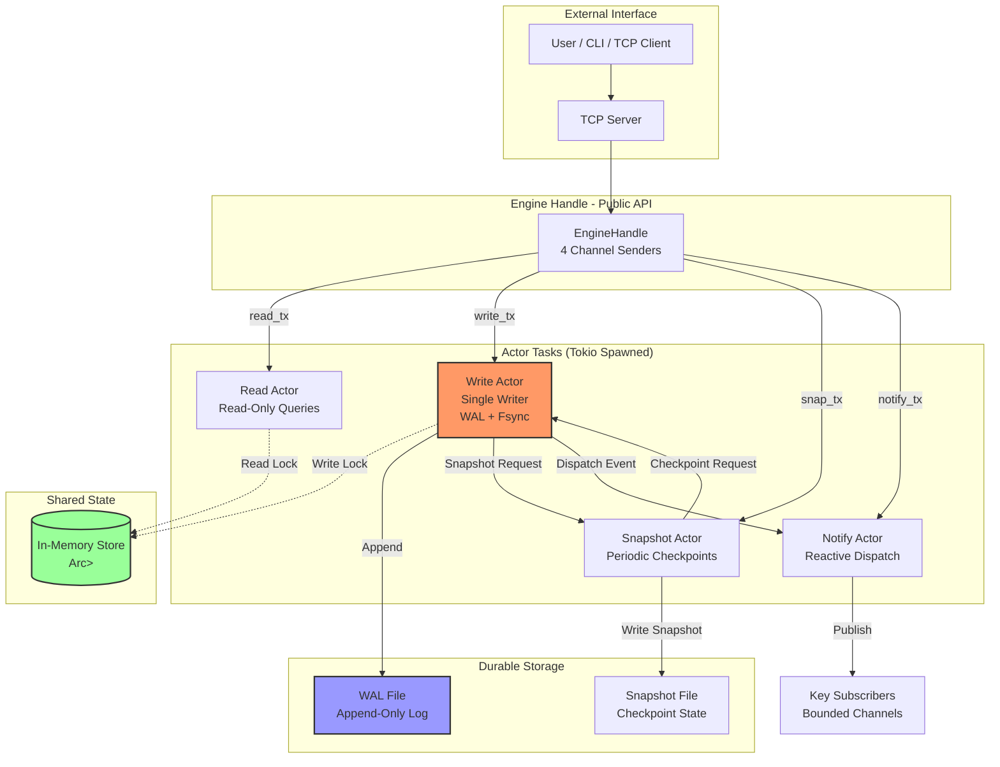
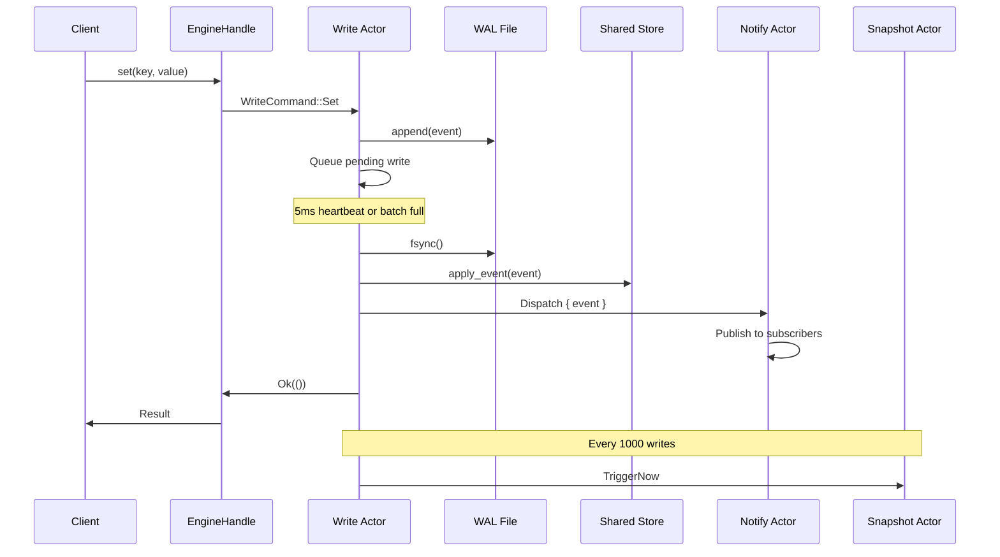
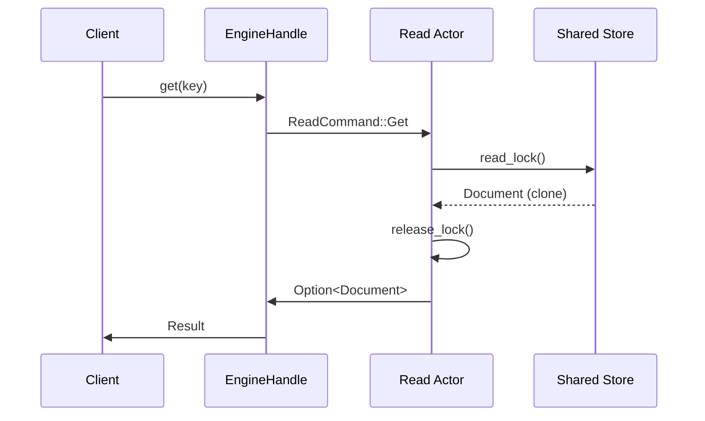
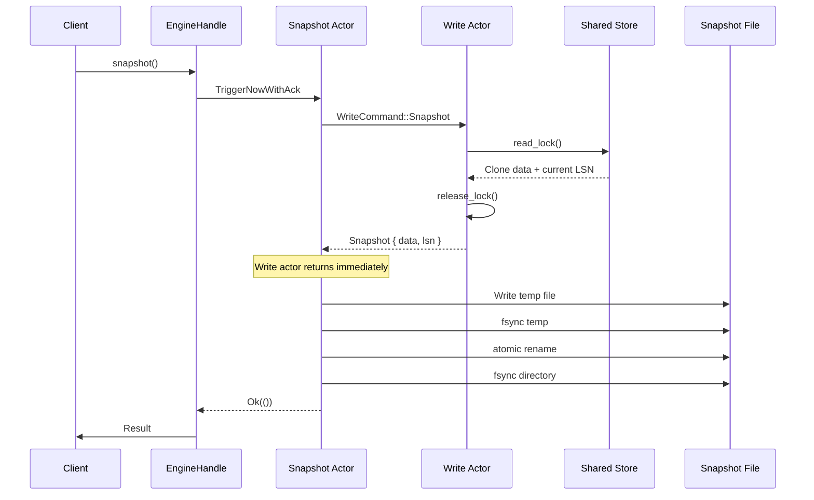

# FluxDB Actor Model Runtime - Comprehensive Notes

## Overview

FluxDB implements an **actor-based concurrency model** using Tokio's async runtime. The design follows the principle of **separation of concerns**, where each actor is responsible for a specific task and communicates with others via message-passing channels.

---

## Architecture Diagram



---

## Actor Responsibilities

### 1. **Write Actor** (`write_actor`)

**Purpose:** Single-writer actor that owns all write operations, WAL durability, and post-durability application.

**Owns:**
- WAL append operations
- Fsync batching (5ms heartbeat timer)
- Pending write queue management
- Post-durability apply to shared store
- Event dispatch coordination

**Why Separated:**
> The write actor is separated to enforce **single-writer serialization**. This ensures:
> 1. **WAL ordering guarantee**: All writes are serialized through a single actor, preventing interleaved WAL entries
> 2. **Fsync batching**: Multiple writes can be batched together before fsync, improving throughput
> 3. **Durability barrier**: Writes are not applied to memory until fsync completes, ensuring WAL-before-memory invariant
> 4. **Pending queue management**: Writes wait in a pending queue until durability is confirmed

**Channel Interface:**
- **Input:** `mpsc::Receiver<WriteCommand>`
- **Output to Snapshot:** `mpsc::Sender<SnapshotActorCommand>`
- **Output to Notify:** `mpsc::Sender<NotifyCommand>`

**Write Pipeline:**
```
WriteCommand → WAL Append → Fsync (5ms batch) → Apply to Store → Notify Dispatch → ACK
```

**Key Design Decisions:**

| Decision | Rationale |
|----------|-----------|
| Single actor for writes | Eliminates need for WAL locking; ensures total ordering |
| 5ms heartbeat timer | Bounds latency for idle writes; prevents indefinite batching |
| Pending write queue | Separates durability from application; enables batch fsync |
| Opportunistic drain | `try_recv()` drains all pending messages quickly for throughput |

---

### 2. **Read Actor** (`read_actor`)

**Purpose:** Handles read-only queries against the shared in-memory store.

**Owns:**
- Read-lock acquisition on shared store
- Document lookup and response

**Why Separated:**
> The read actor is separated to enable **concurrent read scaling**:
> 1. **Read-write separation**: Reads don't block writes and vice versa
> 2. **Lock granularity**: Read actor only holds read locks briefly during lookup
> 3. **Future extensibility**: Can add read replicas or caching layers without changing write path
> 4. **Channel backpressure**: Independent channel prevents reads from blocking write commands

**Channel Interface:**
- **Input:** `mpsc::Receiver<ReadCommand>`
- **Shared State:** `Arc<RwLock<Store>>` (read-only access)

**Read Pipeline:**
```
ReadCommand → Acquire Read Lock → Lookup → Release Lock → Send Response
```

---

### 3. **Snapshot Actor** (`snapshot_actor`)

**Purpose:** Manages periodic checkpoint creation and durable snapshot persistence.

**Owns:**
- Periodic snapshot scheduling (30-second interval)
- On-demand snapshot triggers
- Snapshot file durability (atomic rename + fsync)

**Why Separated:**
> The snapshot actor is separated to **decouple checkpoint coordination from write operations**:
> 1. **Non-blocking writes**: Write actor doesn't wait for snapshot I/O; it only returns the snapshot payload
> 2. **Separation of concerns**: Write actor focuses on WAL durability; snapshot actor handles snapshot file durability
> 3. **Independent scheduling**: Periodic snapshots happen independently of write traffic
> 4. **Two-phase checkpoint**: 
>    - **Phase 1 (Write Actor)**: Returns `Snapshot { data, lsn }` struct - fast, in-memory
>    - **Phase 2 (Snapshot Actor)**: Writes snapshot to disk with atomic rename - slow, I/O bound
> 
> This separation prevents the slow disk I/O of snapshot writing from blocking the critical write path.

**Channel Interface:**
- **Input:** `mpsc::Receiver<SnapshotActorCommand>` (TriggerNow, TriggerNowWithAck)
- **Output to Write:** `mpsc::Sender<WriteCommand>` (requests snapshot payload)

**Snapshot Cycle:**
```
Timer/Trigger → Request Snapshot Payload (from Write Actor) 
              → Serialize Snapshot → Write Temp File → Fsync Temp 
              → Atomic Rename → Fsync Directory
```

**Atomic Snapshot Protocol:**
```
1. Serialize snapshot to temp file (flux.wal.snapshot.tmp)
2. Fsync temp file (durability barrier)
3. Atomic rename (tmp → flux.wal.snapshot)
4. Fsync directory (ensures rename persists)
```

---

### 4. **Notify Actor** (`notify_actor`)

**Purpose:** Manages reactive subscriptions and event dispatch to subscribers.

**Owns:**
- Per-key subscriber registry
- Event dispatch with backpressure handling
- Slow subscriber eviction

**Why Separated:**
> The notify actor is separated to **isolate reactive dispatch from the critical write path**:
> 1. **Non-blocking dispatch**: Subscribers never block database writes
> 2. **Backpressure isolation**: Slow subscribers are evicted without affecting write throughput
> 3. **Independent state**: Subscriber registry is separate from store state
> 4. **Event ordering**: Single actor ensures events for a key are dispatched in order

**Channel Interface:**
- **Input:** `mpsc::Receiver<NotifyCommand>` (Subscribe, Dispatch)
- **Output:** `mpsc::Sender<Event>` to subscribers (bounded channels)

**Dispatch Pipeline:**
```
Dispatch { event } → Lookup subscribers for event.key 
                   → try_send to each subscriber 
                   → Evict slow/full subscribers
```

**Backpressure Handling:**
| Condition | Action |
|-----------|--------|
| Channel closed | Remove subscriber |
| Channel full (slow) | Evict subscriber |
| Successful send | Continue |

**Guarantee:** *Subscribers never block database writes.*

---

## Communication Patterns

### Write Flow (SET/DELETE/PATCH)



### Read Flow (GET)



### Snapshot Flow (CHECKPOINT)



---

## Shared State Management

### Store Architecture

```rust
Arc<RwLock<Store>>
```

**Ownership Model:**
- **Write Actor**: Owns exclusive write access (modifies store after fsync)
- **Read Actor**: Shares read-only access (concurrent reads allowed)
- **Database**: Internal wrapper that manages WAL + Store

**Why Arc<RwLock>:**
| Component | Lock Type | Rationale |
|-----------|-----------|-----------|
| Arc | Reference counting | Multiple actors share same store |
| RwLock | Read-write lock | Reads are concurrent; writes are exclusive |

**Lock Granularity:**
- Write actor holds write lock **only during apply** (post-durability)
- Read actor holds read lock **only during lookup**
- Lock is never held during I/O operations

---

## Channel Topology

```
┌─────────────────────────────────────────────────────────────┐
│                     EngineHandle                             │
│  ┌──────────┬──────────┬──────────┬──────────┐              │
│  │ read_tx  │ write_tx │ snap_tx  │ notify_tx│              │
│  └────┬─────┴────┬─────┴────┬─────┴────┬─────┘              │
└───────┼──────────┼──────────┼──────────┼────────────────────┘
        │          │          │          │
        ▼          ▼          ▼          ▼
   ┌────────┐ ┌────────┐ ┌────────┐ ┌────────┐
   │  Read  │ │ Write  │ │Snapshot│ │ Notify │
   │ Actor  │ │ Actor  │ │ Actor  │ │ Actor  │
   └────────┘ └────────┘ └────────┘ └────────┘
      │          │          │          │
      │          │          │          ▼
      │          │          │    Subscribers
      │          │          │
      │          │          ▼
      │          │     (requests Snapshot)
      │          │          │
      │          ▼          │
      │     ┌────────┐      │
      │     │  WAL   │      │
      │     └────────┘      │
      │          │          │
      ▼          ▼          ▼
   ┌────────────────────────────┐
   │    Arc<RwLock<Store>>      │
   │    (Shared In-Memory)      │
   └────────────────────────────┘
```

**Channel Capacities:**
- All channels: **32 messages** (bounded)
- Bounded channels provide backpressure
- Prevents unbounded memory growth

---

## Task Separation Rationale Summary

| Task | Actor | Why Separated |
|------|-------|---------------|
| **Writes** | Write Actor | Single-writer serialization; WAL ordering; fsync batching |
| **Reads** | Read Actor | Concurrent read scaling; read-write lock separation |
| **Snapshot Payload** | Write Actor | Fast in-memory operation; owns store read lock |
| **Snapshot Durability** | Snapshot Actor | Slow I/O operation; shouldn't block writes; atomic file protocol |
| **Event Dispatch** | Notify Actor | Non-blocking dispatch; backpressure isolation; subscriber management |

### Key Insight: Snapshot Separation

The snapshot operation is split into **two tasks**:

```
┌─────────────────────────────────────────────────────────────┐
│  Task 1: Snapshot Payload (Write Actor)                     │
│  - Acquires read lock on store                              │
│  - Clones data + captures current LSN                       │
│  - Returns Snapshot struct                                  │
│  - Time: O(n) memory copy, fast                             │
└─────────────────────────────────────────────────────────────┘
                          │
                          ▼
┌─────────────────────────────────────────────────────────────┐
│  Task 2: Snapshot Durability (Snapshot Actor)               │
│  - Serializes to JSON                                       │
│  - Writes to temp file                                      │
│  - Fsync temp file                                          │
│  - Atomic rename                                            │
│  - Fsync directory                                          │
│  - Time: O(n) disk I/O, slow                                │
└─────────────────────────────────────────────────────────────┘
```

**Why this separation matters:**
1. **Write actor stays fast**: Only does memory copy, returns immediately
2. **I/O isolation**: Disk writes happen in separate actor
3. **No blocking**: Write actor can continue processing new writes
4. **Clear responsibility**: Write actor owns store state; Snapshot actor owns file durability

---

## Runtime Initialization

```rust
pub fn start() -> EngineRuntime {
    // 1. Create channels
    let (read_tx, read_rx) = mpsc::channel::<ReadCommand>(32);
    let (write_tx, write_rx) = mpsc::channel::<WriteCommand>(32);
    let (snap_tx, snap_rx) = mpsc::channel::<SnapshotActorCommand>(32);
    let (notify_tx, notify_rx) = mpsc::channel::<NotifyCommand>(32);

    // 2. Create shared state
    let shared_store = Arc::new(RwLock::new(Store::new()));

    // 3. Spawn actors
    tokio::spawn(read_actor(read_rx, shared_store.clone()));
    tokio::spawn(write_actor(write_rx, shared_store, snap_tx.clone(), notify_tx.clone()));
    tokio::spawn(snapshot_actor(snap_rx, write_tx.clone(), Duration::from_secs(30)));
    tokio::spawn(notify_actor.run());

    // 4. Return handle
    let handle = EngineHandle::new(read_tx, write_tx, snap_tx, notify_tx);
    EngineRuntime { handle }
}
```

**Initialization Order:**
1. Channels created first (communication infrastructure)
2. Shared store created (state)
3. Actors spawned (consumers)
4. Handle returned (public API)

---

## Concurrency Guarantees

| Invariant | Enforcement |
|-----------|-------------|
| **WAL-before-memory** | Write actor fsyncs before apply |
| **Single-writer serialization** | Only write actor can modify WAL |
| **Concurrent reads** | RwLock allows multiple readers |
| **Event ordering** | Notify actor dispatches in order |
| **Backpressure** | Bounded channels + slow subscriber eviction |
| **Crash recovery** | WAL replay from last snapshot LSN |

---

## Performance Characteristics

| Operation | Latency Bound | Throughput Factor |
|-----------|---------------|-------------------|
| Write (SET/DEL/PATCH) | Fsync latency (~5ms batch) | Batch size |
| Read (GET) | Memory lookup (~500ns) | Lock contention |
| Snapshot | Disk I/O (async) | Doesn't block writes |
| Notify Dispatch | Channel send (~1μs) | Subscriber count |

**Benchmark Results (from README):**
- **SET**: 23,148 ops/sec (P99: 17.25ms)
- **GET**: 210,310 ops/sec (P99: 731.94μs)
- **MIXED**: 14,184 ops/sec (P99: 300.09ms)

---

## Failure Handling

### Write Actor Failures
- **Fsync failure**: All pending writes fail; error returned to clients
- **Channel closed**: Actor exits gracefully

### Snapshot Actor Failures
- **Serialize failure**: Error returned; next cycle retries
- **File I/O failure**: Error returned; snapshot incomplete

### Notify Actor Failures
- **Slow subscriber**: Evicted automatically
- **Channel closed**: Subscriber removed

---

## Design Principles

1. **Message-passing over shared memory**: Actors communicate via channels, not shared state
2. **Single responsibility**: Each actor owns one concern
3. **Non-blocking I/O**: Slow operations (snapshot, notify) don't block writes
4. **Backpressure**: Bounded channels prevent unbounded memory growth
5. **Durability first**: WAL fsync before memory apply
6. **Separation of phases**: Snapshot payload (fast) vs snapshot durability (slow)

---

## References

- `src/engine/runtime.rs` - Runtime initialization
- `src/engine/write_actor.rs` - Write actor implementation
- `src/engine/read_actor.rs` - Read actor implementation
- `src/engine/snapshot_actor.rs` - Snapshot actor implementation
- `src/engine/notify_actor.rs` - Notify actor implementation
- `src/engine/handler.rs` - EngineHandle public API
- `src/engine/db.rs` - Database internal operations
