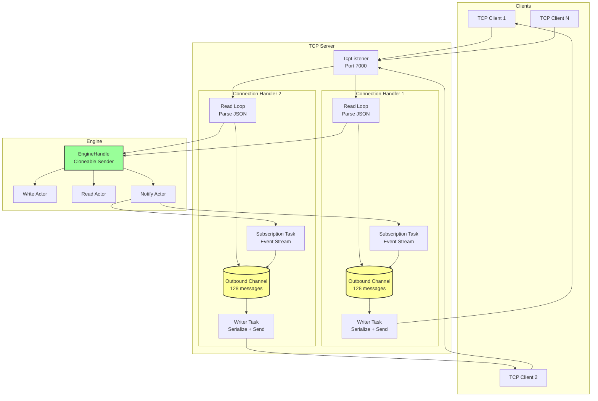
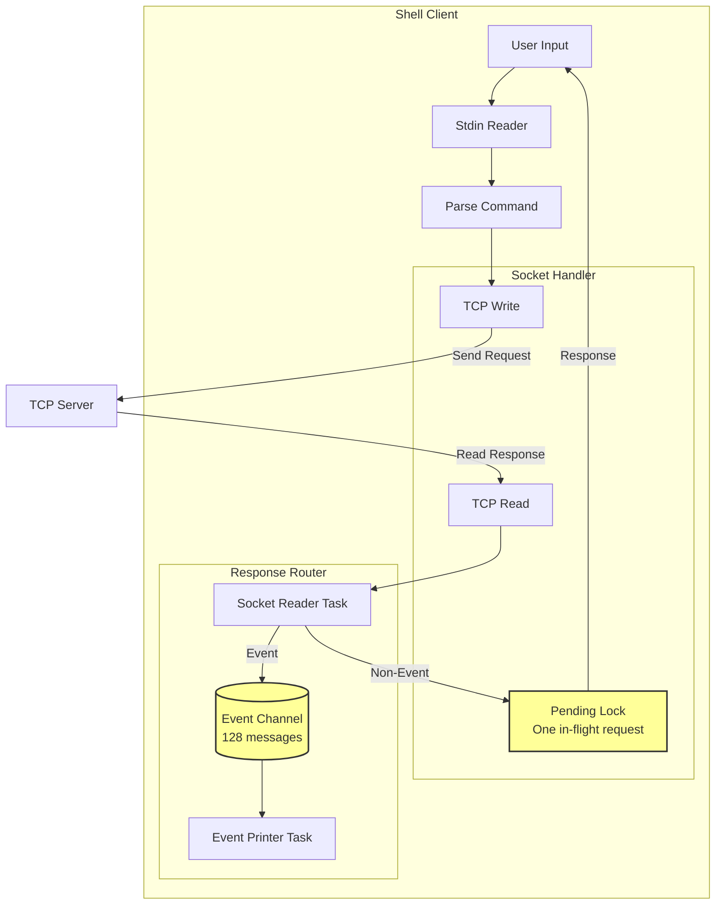
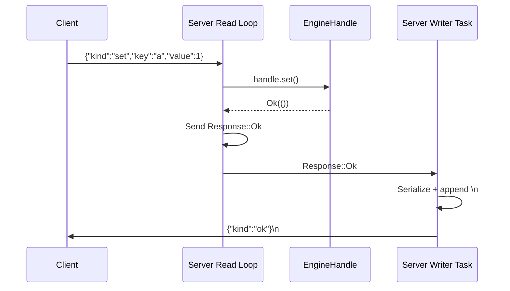
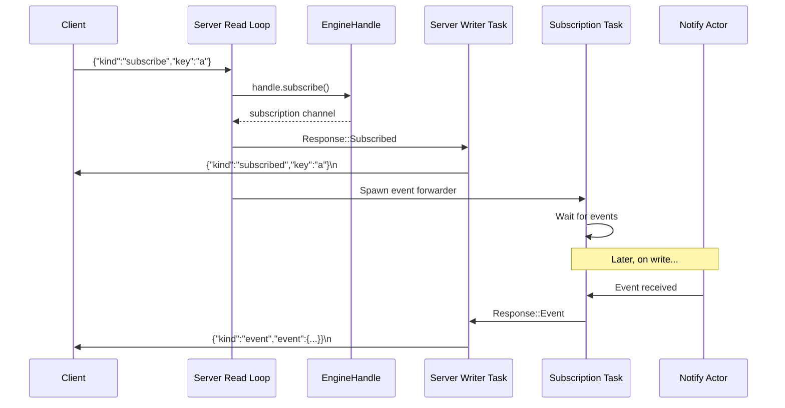
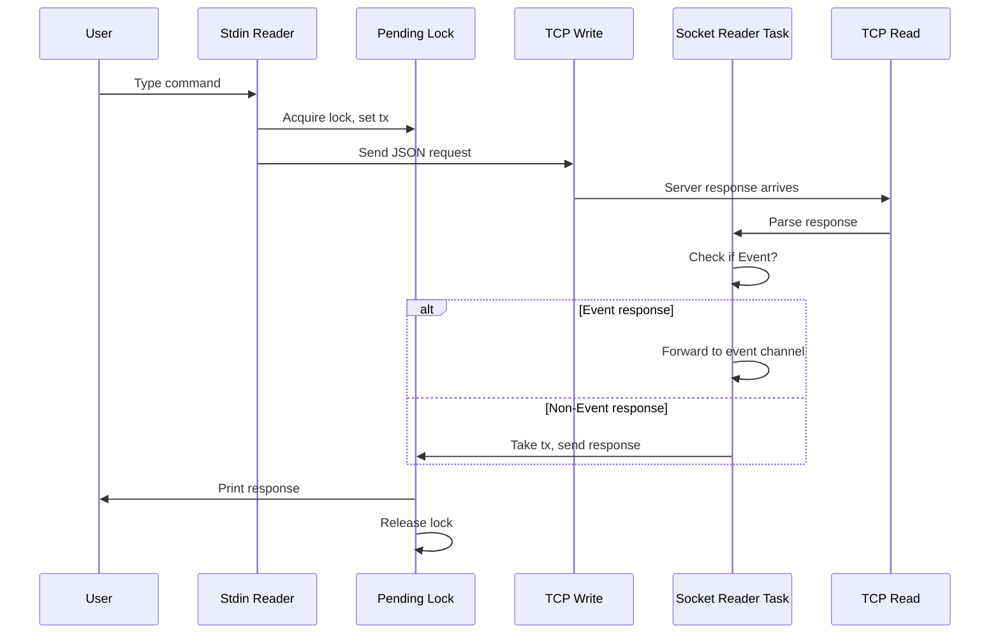

# FluxDB TCP Network Layer - Architecture

## Overview

FluxDB exposes a **line-delimited JSON protocol** over TCP for remote client access. The network layer follows a **per-connection task** model with **split read/write responsibilities** and **asynchronous event streaming** for subscriptions.

---

## System Architecture



---

## Server Components

### 1. TCP Listener

**Location:** `src/bin/server.rs` - `main()`

**Purpose:** Accept incoming TCP connections and spawn per-connection handlers.

**Configuration:**
| Setting | Value | Purpose |
| :--- | :--- | :--- |
| Address | `127.0.0.1:7000` | Localhost only |
| TCP_NODELAY | `true` | Disable Nagle's algorithm for lower latency |

**Connection Flow:**
```
TcpListener::bind() → accept() → set_nodelay(true) → spawn handle_connection()
```

---

### 2. Connection Handler

**Location:** `src/bin/server.rs` - `handle_connection()`

**Purpose:** Handle a single client connection with independent read/write paths.

**Components:**

| Component | Type | Purpose |
| :--- | :--- | :--- |
| `read_half` | `TcpStream (read)` | Incoming request parsing |
| `write_half` | `TcpStream (write)` | Outgoing response sending |
| `out_tx` | `mpsc::Sender<Response>` | Outbound response channel |
| `out_rx` | `mpsc::Receiver<Response>` | Writer task receives responses |
| `writer_task` | Spawned task | Serializes and writes responses |

**Channel Configuration:**
| Channel | Capacity | Purpose |
| :--- | :--- | :--- |
| Outbound (per connection) | 128 messages | Backpressure for slow clients |

---

### 3. Read Loop

**Location:** `src/bin/server.rs` - `handle_connection()` (main loop)

**Purpose:** Parse incoming JSON requests and dispatch to engine.

**Flow:**
```
Read line → Parse JSON → Match Request → Engine call → Send Response
```

**Request Handling:**

| Request Type | Engine Call | Response |
| :--- | :--- | :--- |
| `Set { key, value }` | `handle.set()` | `Ok` / `Error` |
| `Get { key }` | `handle.get()` | `Value { doc }` / `Error` |
| `Del { key }` | `handle.delete()` | `Ok` / `Error` |
| `Patch { key, delta }` | `handle.patch()` | `Ok` / `Error` |
| `Snapshot` | `handle.snapshot()` | `Ok` / `Error` |
| `Subscribe { key }` | `handle.subscribe()` | `Subscribed` + `Event` stream |

---

### 4. Writer Task

**Location:** `src/bin/server.rs` - spawned inside `handle_connection()`

**Purpose:** Serialize responses to JSON and write to TCP socket.

**Flow:**
```
Receive Response → Serialize to JSON → Append newline → Write to socket
```

**Why Separated:**
- Read loop can continue parsing while writer sends
- Prevents write blocking from affecting read parsing
- Enables concurrent subscription event streaming

---

### 5. Subscription Handler

**Location:** `src/bin/server.rs` - spawned inside `handle_connection()` (for Subscribe requests)

**Purpose:** Stream real-time events for subscribed keys.

**Flow:**
```
Subscribe request → Get subscription channel → Spawn event forwarder
                  → Forward Event → Response::Event → out_tx
```

**Characteristics:**
- Multiple subscription tasks per connection (one per key)
- Each spawns independent task to forward events
- Events flow through same outbound channel as regular responses

---

## Client Components

### 1. CLI Client

**Location:** `src/bin/client.rs`

**Purpose:** Provide command-line interface for interacting with FluxDB server.

**Modes:**

| Mode | Command | Purpose |
| :--- | :--- | :--- |
| Run once | `client set key value` | Single command, immediate exit |
| Shell | `client shell` | Interactive REPL session |

---

### 2. Run Once Mode

**Location:** `src/bin/client.rs` - `run_once()`

**Purpose:** Execute single command and exit.

**Flow:**
```
Parse CLI args → Build Request → Connect TCP → Send JSON → Read Response → Print → Exit
```

**Use Cases:**
- Scripting
- One-off queries
- Automation

---

### 3. Shell Mode

**Location:** `src/bin/client.rs` - `run_shell()`

**Purpose:** Interactive REPL for continuous database interaction.

**Architecture:**



**Components:**

| Component | Type | Purpose |
| :--- | :--- | :--- |
| `pending` | `Arc<Mutex<Option<oneshot::Sender>>>` | Track in-flight request response channel |
| `event_tx/event_rx` | `mpsc::channel(128)` | Stream subscription events separately |
| `socket_reader` | Spawned task | Parse responses and route to pending/events |
| `event_printer` | Spawned task | Print subscription events asynchronously |

**Why Pending Lock:**
- Shell allows one in-flight request at a time
- Prevents response/command mismatch
- Simple ordering without request IDs

---

## Network Protocol

### Wire Format

**Line-delimited JSON:**
```
{"kind":"set","key":"a","value":1}\n
{"kind":"ok"}\n
```

**Characteristics:**
| Property | Value |
| :--- | :--- |
| Encoding | UTF-8 JSON |
| Delimiter | Newline (`\n`) |
| Direction | Full-duplex |
| Framing | Line-based |

---

### Request Types

```rust
#[derive(Debug, Clone, Serialize, Deserialize)]
#[serde(tag = "kind", rename_all = "snake_case")]
pub enum Request {
    Set { key: String, value: Value },
    Get { key: String },
    Del { key: String },
    Patch { key: String, delta: Value },
    Snapshot,
    Subscribe { key: String },
}
```

**Example Requests:**

| Operation | JSON |
| :--- | :--- |
| Set | `{"kind":"set","key":"user","value":{"name":"vaibhav"}}` |
| Get | `{"kind":"get","key":"user"}` |
| Delete | `{"kind":"del","key":"user"}` |
| Patch | `{"kind":"patch","key":"user","delta":{"age":21}}` |
| Snapshot | `{"kind":"snapshot"}` |
| Subscribe | `{"kind":"subscribe","key":"user"}` |

---

### Response Types

```rust
#[derive(Debug, Clone, Serialize, Deserialize)]
#[serde(tag = "kind", rename_all = "snake_case")]
pub enum Response {
    Ok,
    Value { doc: Option<Document> },
    Subscribed { key: String },
    Event { event: Event },
    Error { message: String },
}
```

**Example Responses:**

| Type | JSON |
| :--- | :--- |
| Ok | `{"kind":"ok"}` |
| Value | `{"kind":"value","doc":{"value":{"name":"vaibhav"},"version":1}}` |
| Subscribed | `{"kind":"subscribed","key":"user"}` |
| Event | `{"kind":"event","event":{"kind":"put","key":"user",...}}` |
| Error | `{"kind":"error","message":"writer dropped"}` |

---

## Shell Command Mapping

### Client-Side Parsing

**Location:** `src/bin/client.rs` - `parse_shell_request()`

| Shell Command | Request Type |
| :--- | :--- |
| `set <key> <json>` | `Request::Set` |
| `get <key>` | `Request::Get` |
| `del <key>` | `Request::Del` |
| `patch <key> <json>` | `Request::Patch` |
| `snapshot` | `Request::Snapshot` |
| `subscribe <key>` | `Request::Subscribe` |
| `exit` | Close connection |

**Example Session:**
```
> set user {"name":"vaibhav"}
Ok

> get user
Value { doc: Some(Document { value: Object {"name": String("vaibhav")}, version: 1 }) }

> subscribe user
Subscribed { key: "user" }
[event] Event { event: Put { key: "user", ... } }
```

---

## Data Flow Sequences

### Single Request-Response



---

### Subscription Flow



---

### Shell Interactive Flow



---

## Concurrency Model

### Server-Side

| Component | Concurrency |
| :--- | :--- |
| Listener | Sequential accept, spawn per-connection |
| Per-connection | Independent async task |
| Read/Write | Split into separate tasks |
| Subscriptions | Multiple tasks per connection |
| Engine | Shared via cloned EngineHandle |

### Client-Side (Shell)

| Component | Concurrency |
| :--- | :--- |
| Stdin reader | Sequential (one command at a time) |
| Socket reader | Independent spawned task |
| Event printer | Independent spawned task |
| Pending lock | Mutex ensures one in-flight request |

---

## Backpressure Handling

### Server Outbound Channel

| Condition | Behavior |
| :--- | :--- |
| Channel full (128 messages) | `send().await` blocks sender |
| Client disconnected | `write_all()` fails, task exits |
| Slow client | Backpressure propagates to read loop |

### Client Event Channel (Shell)

| Condition | Behavior |
| :--- | :--- |
| Channel full (128 messages) | Subscription events dropped |
| User exits | Channels closed, tasks exit |

---

## Error Handling

### Server Errors

| Error Type | Handling |
| :--- | :--- |
| Invalid JSON | Send `Response::Error`, continue |
| Engine error | Send `Response::Error`, continue |
| TCP write failure | Break loop, close connection |
| TCP read failure | Break loop, close connection |

### Client Errors

| Error Type | Handling |
| :--- | :--- |
| Invalid JSON (shell) | Print error, continue |
| Server closed | Exit shell |
| Response timeout | Print error, continue |

---

## File Structure

```
src/
├── bin/
│   ├── server.rs         # TCP server, per-connection handlers
│   └── client.rs         # CLI client (run_once + shell)
└── net/
    ├── mod.rs            # Module exports
    └── protocol.rs       # Request/Response types
```

---

## Performance Considerations

| Aspect | Optimization |
| :--- | :--- |
| TCP_NODELAY | Disabled Nagle's algorithm for lower latency |
| Line buffering | BufReader for efficient line parsing |
| Split streams | Read/write halves for concurrent I/O |
| Outbound channel | 128-message buffer for backpressure |
| Per-connection task | Isolated failures, no shared state |

---

## References

- `src/bin/server.rs` - TCP server implementation
- `src/bin/client.rs` - CLI client implementation
- `src/net/protocol.rs` - Wire protocol definitions
- `src/engine/handler.rs` - EngineHandle API
